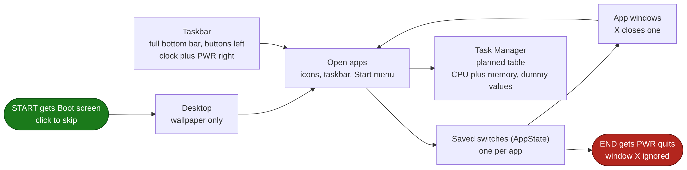
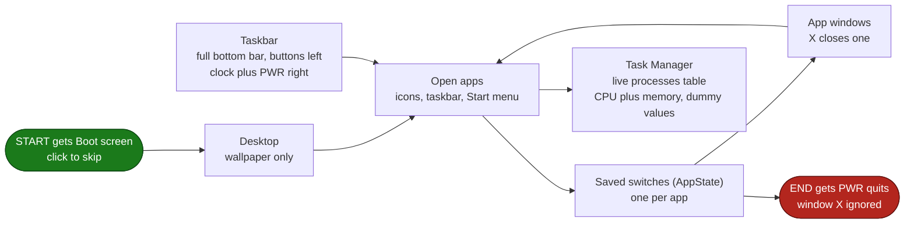
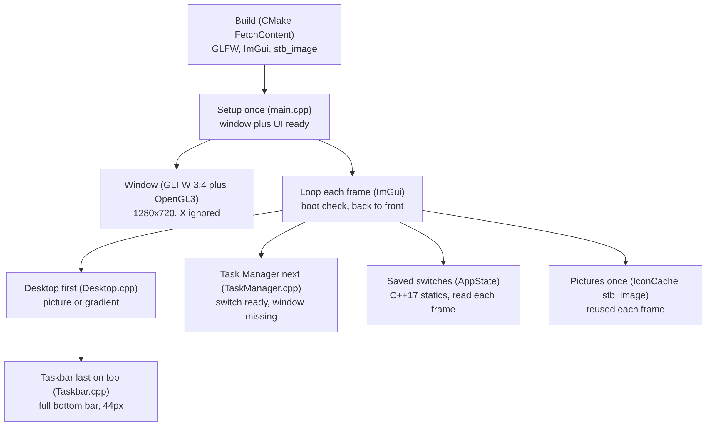
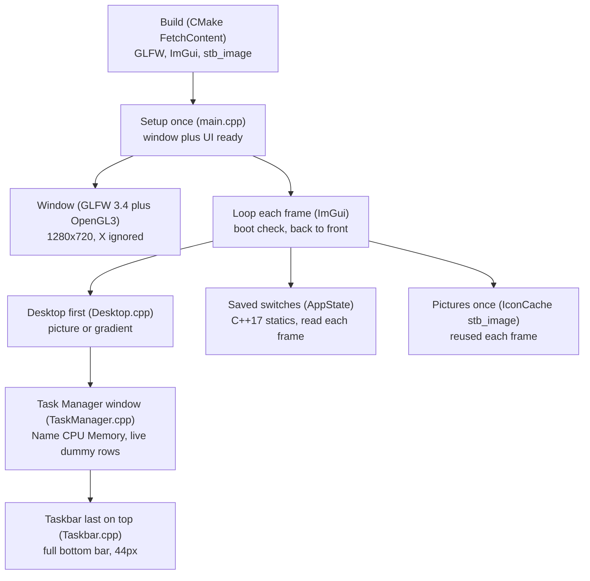

# Architecture — Desktop-Style OS Mockup

This app is a fake computer inside one window. You see a boot screen, then a
desktop with a wallpaper, icons you can click, apps that open, and a bar at
the bottom — like a tiny Windows XP.

For engineers: one C++17 program (`mockup_app`). No kernel, no real
processes. One 1280×720 window redraws layered screens every frame. A shared
list of on/off switches (`AppState`) decides which apps show.

## User flow

In plain steps:

1. START — Boot screen. Short intro, click to skip.
2. Desktop — the wallpaper. Drawn first so all else sits on top. The brief
   also wants the clock and PWR here; in the code both live in the taskbar
   tray instead (see gaps below).
3. Open apps — three doors to the same rooms: desktop icons, taskbar
   buttons, Start menu rows. All flip the same switch, so they agree.
4. Saved switches (`AppState`) — one on/off switch per app: Calculator,
   Paint, File Explorer, Browser, Task Manager.
5. App windows — four finished app screens (Calculator, Paint, File
   Explorer, Browser), above the brief's minimum of two, plus the Task
   Manager window from step 7. Each X closes only its own.
6. Taskbar — full-width bottom bar. Start plus app buttons on the left,
   live clock plus PWR on the right. Start menu floats above with five rows.
7. Task Manager — a Windows-style floating window with a Processes table:
   Name, CPU, and Memory columns over five dummy rows (`csopesy.exe`,
   `dwm.exe`, and friends). CPU numbers drift a little every frame so it
   feels alive. Its X button closes only it, like the other apps.
8. END — PWR quits. The outer window X is ignored on purpose.

## How it is made

What each box means:

- Setup once (`src/main.cpp`) — opens the window and prepares the UI
  toolkit: `glfwCreateWindow`, OpenGL context, ImGui context with docking.
- Window (`GLFW 3.4` + `OpenGL::GL`) — the frame all lives in, drawn via
  the `ImGui_ImplGlfw` / `ImGui_ImplOpenGL3` backends. Close button muted
  on purpose.
- Loop each frame (Dear ImGui `docking` branch) — the heartbeat, about 60
  draws per second: `glfwPollEvents`, `ImGui::NewFrame`, draw, `Render`,
  swap buffers (vsync via `glfwSwapInterval(1)`). Skips all else while the
  boot screen shows.
- Desktop first (`src/ui/Desktop.cpp`) — one picture stretched full screen
  (`assets/images/background.png`), gradient via `AddRectFilledMultiColor`
  if missing. Spec: `specs/feat/feat_desktop.md`.
- Task Manager window (`src/ui/TaskManager.cpp`, own global
  `g_task_manager` drawn in `main.cpp` between apps and taskbar) — floating
  400×300 `BeginTable` with Name, CPU, Memory columns over five dummy rows;
  CPU drifts each frame via an RNG scaled by frame time, clamped to
  [0, 100]. Spec: `specs/feat/feat_taskmgr.md`.
- Taskbar last on top (`src/ui/Taskbar.cpp`, `kTaskbarHeight = 44.0f`) —
  slim full-width bar. `ImageButton` icons flip switches, open apps get an
  underline, tray shows live `HH:MM:SS` (`strftime`) plus PWR.
  Spec: `specs/feat/feat_taskbar.md`.
- Saved switches (`AppState`, C++17 statics) — shared true/false list the
  whole app reads each frame. Ref: `include/core/AppState.h`.
- Pictures once (`IconCache` + `stb_image`) — `stbi_load` decodes each PNG
  a single time into one OpenGL texture, kept in a static-map cache.
  Refs: `src/ui/IconCache.cpp`, `assets/`.
- Build downloads (`CMake FetchContent`) — one setup step fetches the GLFW
  3.4 tarball plus the ImGui `docking` git tag into `build/_deps/`, grabs
  `stb_image.h`, copies `assets/`, and builds the `mockup_app` target
  (linked against `imgui glfw OpenGL::GL`). Ref: `CMakeLists.txt`.

## Gaps versus the brief

- Desktop brief wants clock plus PWR on the Desktop layer. Both work but
  sit in the taskbar tray. Fix: move or copy them into Desktop.
- Taskbar brief wants three buttons minimum with two unique screens plus
  Task Manager. Done and beyond: five buttons, four unique screens.
- Task Manager brief wants the processes table with dummy values. Done:
  five rows, live CPU drift, native X close. Only remaining piece is the
  phase-8b footer (`Processes: <n> | Total CPU: <sum>`) from
  `specs/feat/feat_taskmgr.md` §4.
